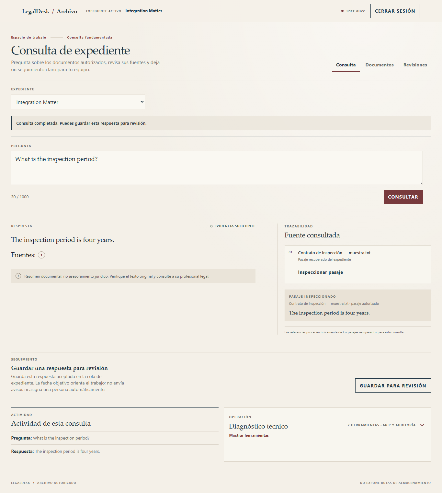
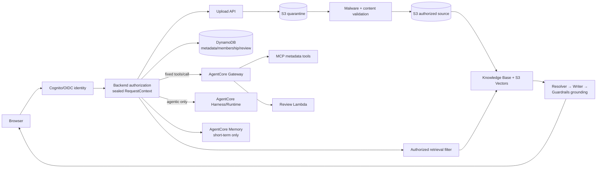

# LegalDesk

I conceived LegalDesk as a personal engineering project to explore grounded legal-document
assistance, tenant isolation, and secure AWS agent orchestration. It is a
portfolio MVP built on Amazon Bedrock AgentCore that demonstrates how retrieval,
authorization, citations, tool calls and bounded agentic workflows can be
composed without allowing the browser or the model to define access scope.

> **Release-record status: `CONSTRAINED_PROD_BETA_DEPLOYED`**
>
> This is an educational MVP, not legal advice or a production legal system.
> The deployed scope is limited to the authenticated beta using only public or
> wholly fictional documents and pre-provisioned users. It is not certified
> for real legal/client data, anonymous signup or strict TLS/custom domains.

The constrained public beta is reachable at
[`https://d3nxeyrpa3juwl.cloudfront.net`](https://d3nxeyrpa3juwl.cloudfront.net)
with pre-provisioned Cognito access and fictional/public documents only. The
loopback entry point remains the reproducible local development path; neither
path permits anonymous signup or real legal/client data.

## Workspace preview

The local candidate separates **Consulta**, **Documentos**, and **Revisiones**,
keeps answers beside their sources, and reveals review fields only when needed.
The cream/navy/burgundy interface remains dependency-free. Technical diagnostics
provide document summaries and a bounded event timeline, with raw JSON optional.



[Mobile preview](docs/images/workspace-local-mobile.png). These captures show
the **local candidate UI**, whose approved static assets are now deployed in
the constrained public beta. All displayed data is fictional.

## What it demonstrates

- Grounded RAG over authorized passages with exact, inspectable citations.
- Server-derived tenant, matter, membership and conversation scope.
- Deterministic metadata and durable review-queue actions through AgentCore Gateway,
  MCP and Lambda.
- AgentCore Harness reserved for genuinely agentic, model-selected workflows.
- Short-term, actor/session/matter-scoped history; long-term memory is disabled.
- Redacted, allowlisted application telemetry rather than document or prompt
  content logging.

## Architecture



The browser supplies selectors and questions, never authority. The backend
reloads membership and derives an immutable request scope before retrieval or
tool access. The model cannot choose a tenant, matter, document, review owner,
S3 key or memory actor. See the [final architecture](docs/architecture-final.md)
for the complete trust and data lifecycle.

### Deterministic and agentic routes

- **Grounded answers:** authorized retrieval feeds a schema-constrained
  Resolver, then an Answer Writer, then contextual grounding. The backend
  owns status and citation validity.
- **Explicit UI actions:** metadata and review-queue commands use one fixed
  backend → Gateway `tools/call` path. Gateway, MCP and the target handler
  reauthorize the same scope; Harness is not used as the router. Review
  snapshots are server-derived and bounded; the queue is purpose-specific and
  is not AgentCore long-term Memory.
- **Agentic workflows:** model-selected tool use may go through Harness with
  the same sealed JWT-bound scope and server-side authorization.

## Security boundaries

- Authorization is deterministic and server-side; `tenantId` and `matterId`
  from the browser are selectors only.
- Retrieval is filtered before generation, and citation inspection rechecks
  actor, matter, conversation and document access.
- Gateway interceptors and tool handlers reauthorize independently.
- Guardrails protect content but do not replace authorization.
- Retrieved documents are treated as untrusted data, not instructions.
- The public composition persists sessions, OAuth state, citation handles,
  accepted history/reviews and redacted audit records in bounded DynamoDB
  items. The loopback fixture may still use in-memory adapters for local demos.
- Public uploads are bound to a server-owned key and exact signed byte length,
  remain outside the retrieval prefix until malware/content validation passes,
  and are rechecked with `HeadObject` before lifecycle promotion.
- Long-term Memory and direct model credentials are not exposed to the browser.

## Evidence and verification

The following release evidence is historical and is kept separate from the
current local working tree. Run the local commands below for the current count.

- Historical release baseline: **574 tests passed** (`1` platform-specific
  symlink test skipped on Windows).
- **24/24 deterministic evaluations passed** with zero AWS calls.
- **All 15 CloudFormation/SAM templates pass lint**, including the public edge,
  quarantine, reconciliation and operations candidates.
- **Historical bounded AWS browser smoke: PASS** for the fixed synthetic journey
  (`phase14-public-smoke-20260929-final4-02.json`, report SHA-256
  `1431503bd4a336bf552853af4cb8eb7b87a8cc488a44e59b7542e9624281d153`): one
  chat, two citations, cross-matter `403`, 17 audit events, logout `200`, and
  `cleanupErrors=[]`.
  It covered Cognito login, indexed-document display, grounded RAG, citations,
  cross-matter denial, audit and logout. The earlier supervised walkthrough
  separately verified presigned upload, malware validation and indexing.
- **Historical** metadata-only holdout `phase14-holdout-20260929-prod-final4.json`
  passed 14/14 with 27 calls and zero retries. It is pinned to release commit
  `0c8bb718e58811afff2085114dad7821cf573e3f` and artifact SHA-256
  `99d074e793335f2867266b07ae091cb110a4747b8ad51e9180b031a2091f4f31`; the
  approved independent attestation v1.1.0 has SHA-256
  `3d833232cabb1d290544009c31c7b9ecda0201264d9c331dc7d52cb799d48dc2`.
  Earlier failed reports and attestations remain immutable history.

Evidence classes, acceptance scenarios and remaining gates are recorded in the
[Phase 13 acceptance ledger](docs/phase-13-acceptance.md). The smoke result is
integration evidence, not production certification or a claim of broad legal
accuracy.

## Local verification

Local candidate checked on **2026-10-01**: **591 tests**, one Windows-specific
skip; prior local Chrome E2E evidence passed at 375/768/1024/1365/1440 px,
including citations, review transitions, diagnostics and logout.
GitHub Actions run `36874101068` passed 591 Python tests on Linux and the
pinned offline frontend behavior gate at its 1365/reduced viewports, covering
document actions, upload safety and query feedback. The approved release is
deployed as a constrained public beta; this evidence does not claim real-provider
auth, RAG, ingestion or business-data smoke coverage.

The supported local checks require Python 3.11+:

```powershell
python -m pip install -e '.[aws,release-tools]' -e agent
python -B -m unittest discover -s tests -q
python -m legaldesk --help
```

The pull-request checks reproduce the offline gate without AWS credentials or
deployment steps:

```powershell
$env:AWS_EC2_METADATA_DISABLED = "true"
python -B -m unittest discover -s tests -q
node tests/phase13_live_browser_helpers.test.cjs
node tests/phase13_manual_browser_helpers.test.cjs
node --check frontend/app.js
node --check frontend/citations.js
```

These checks use local doubles and syntax/helper tests only; they do not run
the public URL, invoke AWS, or publish artifacts.
The GitHub workflow additionally runs the document-view contract and the
offline frontend behavior gate with Node 24 and pinned Playwright 1.62.1;
neither gate uses provider credentials or deployment steps.

Run the deterministic evaluation without AWS or model inference:

```powershell
python evals/run_evals.py --output evals/results/phase12-local-report.json
```

For the test-only local browser journey, start the fixture server and then run
the browser acceptance command described in [Phase 13 run instructions](docs/phase-13-run.md).
The AWS-backed entry point and its approval boundary are documented there; do
not enable AWS mode without the separately authorized smoke gate.

## Repository layout

```text
backend/   Domain services, authorization, retrieval and HTTP application
agent/     AgentCore integration adapters and package
frontend/  Dependency-free shared local/public UI and citation panel
infra/     CloudFormation templates and scoped deployment/teardown notes
evals/     Synthetic datasets, deterministic runner and evidence reports
tests/     Unit, integration, security and browser acceptance coverage
docs/      Architecture, trust boundaries, acceptance and release gates
```

For a reproducible local preview, set `PYTHONPATH` to the repository's
`backend/src`, `agent/src`, and `tests`, start
`tests/phase13_browser_server.py`, then run the interactive offline browser
against the printed loopback URL (fictional login; no credentials required):

```powershell
$env:PYTHONPATH = "backend/src;agent/src;tests"
python tests/phase13_browser_server.py
# In a second terminal, use the baseUrl printed by the server:
node tests/phase13_manual_browser.cjs http://localhost:PORT
```

The runner requires a locally installed Playwright module (and optionally
`BROWSER_EXECUTABLE`); it blocks non-loopback traffic and uses fictional IdP
doubles. The manual browser flow is documented in
[`docs/phase-13-manual-demo.md`](docs/phase-13-manual-demo.md).

## Limits and cost considerations

The repository contains both a loopback demo and a deployed candidate for a
constrained authenticated beta using CloudFront, API Gateway, Lambda and
durable DynamoDB state. Promotion evidence is complete for this narrow scope;
the default CloudFront TLS certificate is an accepted documented residual and
is not claimed as strict TLS. Anonymous signup and real legal/client documents
remain outside the approved scope.

S3, S3 Vectors, DynamoDB, Bedrock, AgentCore, Lambda and CloudWatch can incur
charges. Local tests and deterministic evaluations use no AWS calls. Any AWS
deployment or real-model run requires the documented approval, budget and
teardown procedure.

CD is triggered automatically only when publishing to `prod`; manual dispatch
requires `DEPLOY_PROD`. Its scope is limited to the existing public-beta stack,
immutable artifact prefix, five frontend keys, and the Lambda code/API
integration update allowed by the change set. Promotion by PR is the intended
procedure; mandatory branch protection is unavailable on the current GitHub
plan, so this project does not claim platform enforcement against direct pushes.

## Further reading

- [Production readiness gate](docs/production-readiness.md)
- [Continuous delivery and rollback gate](docs/continuous-delivery.md)
- [Phase 14 public-beta plan](PLAN_14_PUBLIC_BETA.md)
- [Phase 14 semantic holdout](docs/phase-14-holdout.md)
- [Phase 14 operations runbook](docs/phase-14-operations-runbook.md)

- [Periodic operations checklist](docs/phase-14-operations-checklist.md)
- [Guided offline manual demo](docs/phase-13-manual-demo.md)
- [Portfolio demo script for v1.0.0-beta.1](docs/portfolio-demo-v1.0.0-beta.1.md)
- [Release notes for v1.0.0-beta.1](docs/release-notes-v1.0.0-beta.1.md)
- [Phase 13 application run instructions](docs/phase-13-run.md)
- [Threat model](docs/threat-model.md) and [authorization matrix](docs/authorization-matrix.md)
- [Frontend boundary](frontend/README.md)
- [Infrastructure notes](infra/README.md)
- [Phase 12 evaluation report](docs/phase-12-evaluation-report.md)
- [Phase 13 live-smoke ledger](docs/phase-13-live-smoke.md)
- [Logout security release note](docs/release-logout-motion-2026-09-30.md)
- [Verified public release record (2026-10-01)](docs/release-preparation-2026-10-01.md)
- [What must change before real legal data](docs/what-i-would-change-before-real-legal-data.md)

Historical phase reports and the detailed release chronology remain in `docs/`;
this README intentionally keeps those operational details out of the project
summary.
