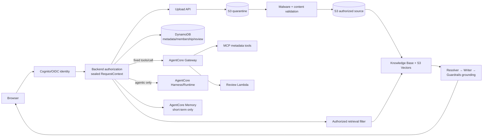

# LegalDesk

LegalDesk is a portfolio project for a grounded, tenant-safe legal-document
assistant built on Amazon Bedrock AgentCore. It demonstrates how retrieval,
authorization, citations, tool calls and bounded agentic workflows can be
composed without allowing the browser or the model to define access scope.

> **Status: `NOT_READY_FOR_PROD`**
>
> This is an educational MVP, not legal advice or a production legal system.
> Use only public or wholly fictional documents. An authenticated public-beta
> stack is deployed, but production promotion remains gated.

## What it demonstrates

- Grounded RAG over authorized passages with exact, inspectable citations.
- Server-derived tenant, matter, membership and conversation scope.
- Deterministic metadata and durable review-queue actions through AgentCore Gateway,
  MCP and Lambda.
- AgentCore Harness reserved for genuinely agentic, model-selected workflows.
- Short-term, actor/session/matter-scoped history; long-term memory is disabled.
- Redacted, allowlisted application telemetry rather than document or prompt
  content logging.

## Architecture



The browser supplies selectors and questions, never authority. The backend
reloads membership and derives an immutable request scope before retrieval or
tool access. The model cannot choose a tenant, matter, document, review owner,
S3 key or memory actor. See the [final architecture](docs/architecture-final.md)
for the complete trust and data lifecycle.

### Deterministic and agentic routes

- **Grounded answers:** authorized retrieval feeds a schema-constrained
  Resolver, then an Answer Writer, then contextual grounding. The backend
  owns status and citation validity.
- **Explicit UI actions:** metadata and review-queue commands use one fixed
  backend → Gateway `tools/call` path. Gateway, MCP and the target handler
  reauthorize the same scope; Harness is not used as the router. Review
  snapshots are server-derived and bounded; the queue is purpose-specific and
  is not AgentCore long-term Memory.
- **Agentic workflows:** model-selected tool use may go through Harness with
  the same sealed JWT-bound scope and server-side authorization.

## Security boundaries

- Authorization is deterministic and server-side; `tenantId` and `matterId`
  from the browser are selectors only.
- Retrieval is filtered before generation, and citation inspection rechecks
  actor, matter, conversation and document access.
- Gateway interceptors and tool handlers reauthorize independently.
- Guardrails protect content but do not replace authorization.
- Retrieved documents are treated as untrusted data, not instructions.
- The public composition persists sessions, OAuth state, citation handles,
  accepted history/reviews and redacted audit records in bounded DynamoDB
  items. The loopback fixture may still use in-memory adapters for local demos.
- Public uploads are bound to a server-owned key and exact signed byte length,
  remain outside the retrieval prefix until malware/content validation passes,
  and are rechecked with `HeadObject` before lifecycle promotion.
- Long-term Memory and direct model credentials are not exposed to the browser.

## Verified evidence

- **562 tests passed** in the current local release-candidate verification
  (`1` platform-specific symlink test skipped on Windows).
- **24/24 deterministic evaluations passed** with zero AWS calls.
- **All 15 CloudFormation/SAM templates pass lint**, including the public edge,
  quarantine, reconciliation and operations candidates.
- **Final bounded AWS browser smoke: PASS** for the fixed synthetic journey:
  Cognito login, presigned upload and indexing, factual and absent-evidence
  RAG, citations, Gateway → MCP metadata, Gateway → Lambda review, cross-matter
  denial, audit and logout.
- Temporary Phase 13 smoke resources were removed and shared stacks restored.
  The bounded 14-case holdout has been executed three times with immutable,
  metadata-only evidence. The latest authorized run reached 13/14 with zero
  retries; runner `1.2.0` / grounding adapter `2.1.0` contains the subsequent
  locally tested directed-relation correction. The semantic gate remains open
  until a newly authorized run passes 14/14 and receives independent
  attestation.

Evidence classes, acceptance scenarios and remaining gates are recorded in the
[Phase 13 acceptance ledger](docs/phase-13-acceptance.md). The smoke result is
integration evidence, not production certification or a claim of broad legal
accuracy.

## Local verification

The supported local checks require Python 3.11+:

```powershell
python -m pip install -e '.[aws]' -e agent
python -B -m unittest discover -s tests -q
python -m legaldesk --help
```

Run the deterministic evaluation without AWS or model inference:

```powershell
python evals/run_evals.py --output evals/results/phase12-local-report.json
```

For the test-only local browser journey, start the fixture server and then run
the browser acceptance command described in [Phase 13 run instructions](docs/phase-13-run.md).
The AWS-backed entry point and its approval boundary are documented there; do
not enable AWS mode without the separately authorized smoke gate.

## Repository layout

```text
backend/   Domain services, authorization, retrieval and HTTP application
agent/     AgentCore integration adapters and package
frontend/  Dependency-free loopback UI and citation panel
infra/     CloudFormation templates and scoped deployment/teardown notes
evals/     Synthetic datasets, deterministic runner and evidence reports
tests/     Unit, integration, security and browser acceptance coverage
docs/      Architecture, trust boundaries, acceptance and release gates
```

## Limits and cost considerations

The repository contains both a loopback demo and a locally validated candidate
for an authenticated public beta using CloudFront, API Gateway, Lambda and
durable DynamoDB state. It is not yet a public service: the AWS change sets,
real browser journey, semantic holdout, alarms/budget notifications, rollback
exercise and owner sign-off remain release gates. Anonymous signup and real
legal/client documents are outside the approved beta scope.

S3, S3 Vectors, DynamoDB, Bedrock, AgentCore, Lambda and CloudWatch can incur
charges. Local tests and deterministic evaluations use no AWS calls. Any AWS
deployment or real-model run requires the documented approval, budget and
teardown procedure.

## Further reading

- [Production readiness gate](docs/production-readiness.md)
- [Phase 14 public-beta plan](PLAN_14_PUBLIC_BETA.md)
- [Phase 14 semantic holdout](docs/phase-14-holdout.md)
- [Phase 14 operations runbook](docs/phase-14-operations-runbook.md)
- [Guided offline manual demo](docs/phase-13-manual-demo.md)
- [Phase 13 application run instructions](docs/phase-13-run.md)
- [Threat model](docs/threat-model.md) and [authorization matrix](docs/authorization-matrix.md)
- [Frontend boundary](frontend/README.md)
- [Infrastructure notes](infra/README.md)
- [Phase 12 evaluation report](docs/phase-12-evaluation-report.md)
- [Phase 13 live-smoke ledger](docs/phase-13-live-smoke.md)
- [What must change before real legal data](docs/what-i-would-change-before-real-legal-data.md)

Historical phase reports and the detailed release chronology remain in `docs/`;
this README intentionally keeps those operational details out of the project
summary.
