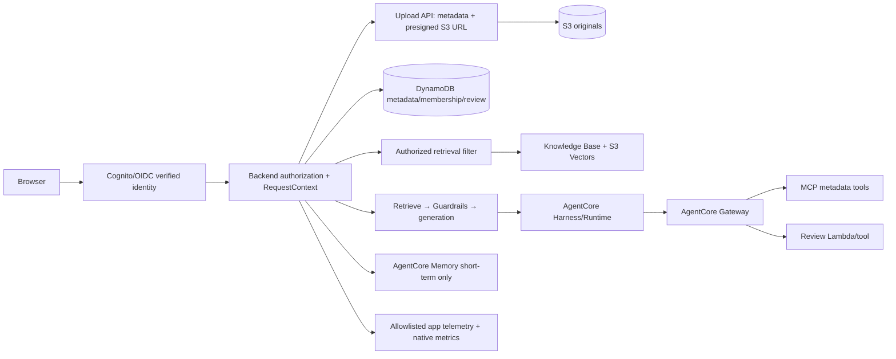

# LegalDesk final MVP architecture

## Ownership and trust

The browser supplies selectors and questions, never authority. Cognito/OIDC or
the verified Gateway edge establishes identity; authorization reloads user,
tenant, matter, membership, and conversation bindings from server-side data.
Only that boundary can seal `RequestContext`. Retrieval, citations, MCP,
review, Memory, and Harness adapters reject forged context.

The model can propose an answer or tool intent but cannot choose a tenant,
matter, S3 key, document body, review owner, or memory actor. Gateway and tool
handlers reauthorize the same scope. Guardrails protect content but do not
replace deterministic authorization.

## Data and lifecycle

Documents use server-generated IDs and S3 keys. Upload metadata begins at
`PENDING_UPLOAD` and moves to `UPLOADED` only after the backend confirms the
expected object exists. Retrieval returns bounded passages and citation IDs;
the model never receives direct S3 or database credentials. Memory is
short-term, scoped by authorized actor/session/matter, with long-term writes
rejected for data minimization.

## Operations and trade-offs

Application telemetry is a closed allowlist of correlation, outcome, operation,
latency, counts, and closed error codes. Questions, answers, passages, tokens,
secrets, and document bodies are excluded. The managed Harness ADOT detail is
disabled after content extraction was observed; the supported audit pointer is
the application telemetry and native metrics, not an asserted provider-wide
trace ID.

S3 Vectors and fixed chunking keep the MVP explainable and cost-conscious, with
less hierarchy control than a custom index. The final architecture intentionally
leaves ingestion cleanup, production data classification, durable audit
retention, and approved real-model evaluation as production work rather than
hidden Phase 12 scope.
