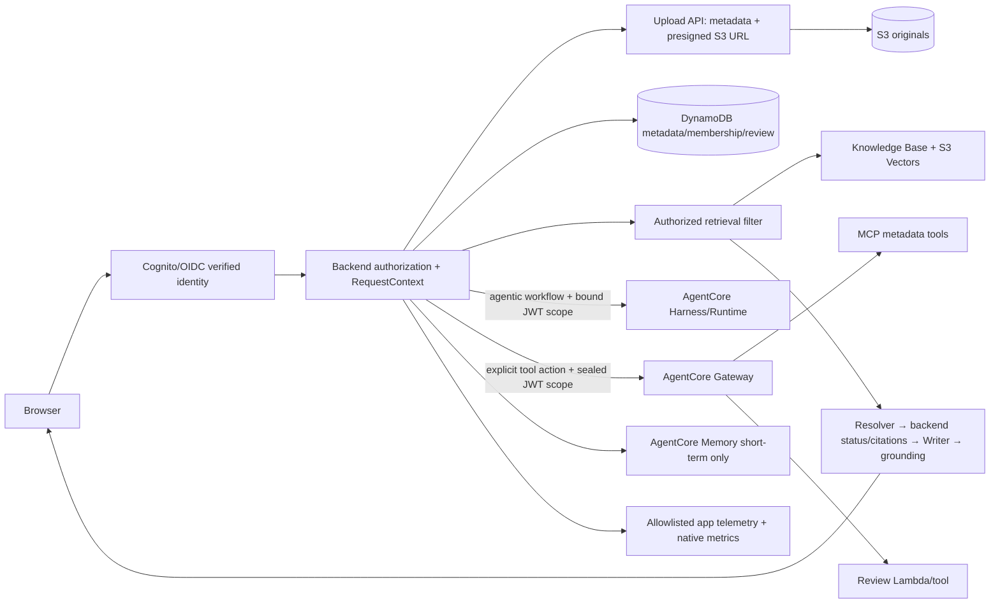

# LegalDesk architecture — Phase 13 application

Phases 00–12 remain complete in their recorded component/bounded scopes.
Phase 13 composes those services through one loopback HTTP application. Local
provider-double integration is distinct from live AWS evidence; release status
remains `NOT_READY_FOR_PROD` until the separately authorized cloud gate.

## Executable application

- Entry: `python -m legaldesk`, with explicit `--allow-aws` required before any
  AWS client/JWKS construction. No implicit fake fallback exists in the product.
- `application.py` constructs concrete adapters; `http_app.py` owns PKCE login,
  server-held tokens, CSRF protection, matter/conversation authorization and
  upload, sync, chat, citation, tool, history and audit routes.
- Chat executes the existing `answer_question` service with concrete Converse
  Resolver/Writer and Bedrock Guardrail contextual-grounding adapters.
  Explicit metadata/review actions use a deterministic backend→Gateway
  `tools/call`; Harness remains available for genuinely agentic,
  model-selected workflows, not as an alternate answer path.
- Tests replace SDK/provider boundaries, not chat or authorization business
  logic. The test-only loopback storage server receives the actual presigned PUT;
  retrieval returns the uploaded fictional bytes after the real sync workflow.
- The minimal frontend connection and final browser acceptance are tracked in
  `phase-13-acceptance.md`; never infer browser acceptance from Python tests alone.

## Composed topology (live provider behavior still pending)

## Ownership and trust

The browser supplies selectors and questions, never authority. Cognito/OIDC or
the verified Gateway edge establishes identity; authorization reloads user,
tenant, matter, membership, and conversation bindings from server-side data.
Only that boundary can seal `RequestContext`. Retrieval, citations, MCP,
review, Memory, and Harness adapters reject forged context.

The model can propose an answer or tool intent but cannot choose a tenant,
matter, S3 key, document body, review owner, or memory actor. Gateway and tool
handlers reauthorize the same scope. Guardrails protect content but do not
replace deterministic authorization.

The application sends explicit metadata and review-queue actions as one fixed
remote-MCP `tools/call` to Gateway with the verified end-user bearer token in
transport headers only. Review create/list/get/update are deterministic
backend operations, not Harness agentic tools. Agentic workflows may still use
Harness with the same sealed binding. An opaque, five-minute invocation record in the existing table binds
subject, matter, Memory actor/session, correlation and action allowlist. The
Gateway interceptor verifies that binding after its JWT edge and reauthorizes;
target handlers reload their own grants/membership before reading or writing.
Retries for one accepted-answer correlation share one server-derived
idempotency key; the short-lived grant ID itself is not used as the retry key.
JWT signature/expiry checks do not implement immediate IdP revocation lookup;
membership revocation is checked against server data on each scoped operation.

## Data and lifecycle

Documents use server-generated IDs and S3 keys. Upload metadata begins at
`PENDING_UPLOAD` and moves to `UPLOADED` only after the backend confirms the
expected object exists. Retrieval returns bounded passages and citation IDs;
the model never receives direct S3 or database credentials. Memory is
short-term, scoped by authorized actor/session/matter, with long-term writes
rejected for data minimization.

The full lifecycle is `PENDING_UPLOAD → UPLOADED → PENDING_INGESTION → INDEXED`,
with `FAILED` on supported failures. A sync is an explicit, bounded data-source
operation, not a per-document AWS job; the real smoke requires a dedicated
synthetic source. Pending uploads/ingestion block the current matter's chat with
`documents_processing`, not `insufficient_evidence`. Abandoned uploads need
manual reconciliation; automatic cleanup is deliberately not implemented.

Citation inspection uses short-lived opaque application handles, verifies the
current actor/matter/conversation and indexed document, then returns its exact
retrieved supporting passage. Citation responses omit S3/internal locations.
The upload transport necessarily receives a temporary S3 PUT URL, but it is
not displayed as a source or recorded in application telemetry.

Short-term Memory stores accepted user/assistant exchanges; only application-
recorded event IDs are returned as history. Harness/tool/rejected outputs in
the same provider session are not automatically surfaced as accepted history.
History is not documentary evidence and is not passed into contextual grounding.

Evidence resolution is a separate backend boundary: a schema-constrained
resolver may return only coverage, conflict, and retrieval-issued supporting
citation IDs. The backend derives `answerable`, `ambiguous`, or
`insufficient_evidence`; a separate Answer Writer produces text and cannot
change that status or its citations. A `none` resolution skips writing and
returns the canonical not-found response. Retrieved passages are untrusted as
instructions, but authoritative documentary evidence once authorized by the
server.

Resolver and writer use independent versioned prompt contracts. The resolver
does not inherit answer-writing, legal-caution, or legacy JSON instructions;
the writer receives the already validated status and selected evidence. This
keeps prompt-injection handling from turning into wholesale evidence removal.

Productive grounding calls ApplyGuardrail with the self-contained question,
selected passages and candidate answer. Missing/malformed assessments or an
intervention fail closed. Scores are aggregate, not per-citation semantic proof.
The lexical oracle remains test-only; the independent 14-case holdout is frozen
and has not been run against real providers. Technical failures return a safe
operational error with null evidence status; partial documentary support can
retain citations under `insufficient_evidence`.

## Operations and trade-offs

Application telemetry is a closed allowlist of correlation, outcome, operation,
latency, counts, and closed error codes. Questions, answers, passages, tokens,
secrets, and document bodies are excluded. The managed Harness ADOT detail is
disabled after content extraction was observed; the supported audit pointer is
the application telemetry and native metrics, not an asserted provider-wide
trace ID.

Each question gets a server UUID; related explicit tool actions use its
server-owned conversation correlation, never an arbitrary browser value.
The audit view attaches authorized actor/matter and all three effective prompt
versions/hashes to redacted stage metadata. It is bounded, process-local demo
audit, not a durable compliance log. Sessions, citation handles and accepted
history selectors also expire or disappear on restart; a new conversation is
then required. The loopback HTTP server is not an internet production server.

S3 Vectors and fixed chunking keep the MVP explainable and cost-conscious, with
less hierarchy control than a custom index. The final architecture intentionally
leaves ingestion cleanup, production data classification, durable audit
retention, and approved real-model evaluation as production work rather than
hidden Phase 12 scope.
