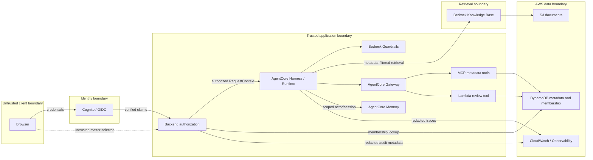

# Architecture and trust boundaries

## Initial component flow

This is the intended topology, not evidence of an executable E2E system.
At the Phase 13 baseline frontend, backend chat and Harness are separate flows;
see `architecture-final.md` and `release-audit.md`.

## Boundary rules

- Browser input is untrusted, including every `tenantId` and `matterId`.
- Identity proves who the caller is; stored membership determines what they may
  access. Authentication is not authorization.
- The backend is the policy enforcement point and source of request scope.
- The model never receives unrestricted S3 or database access.
- Knowledge Base retrieval is filtered with authorized metadata before passages
  reach the model.
- The server loads the versioned system prompt and passes it at the generation
  boundary; prompt text does not make authorization decisions. Response
  metadata may record the prompt version and hash, never the full prompt body.
- Gateway tools validate the same authorized scope; Guardrails cannot replace
  those deterministic checks.
- Retrieved documents are data, never executable instructions.

## Correlation and audit conventions

Every request receives a UUID `correlationId`, generated by the backend unless
a valid trusted edge value is propagated. It is copied to spans and tool calls.
Audit events may contain `correlationId`, `userId`, `tenantId`, `matterId`,
action, resource ID, policy outcome, reason code, latency, and timestamps.
They must not contain tokens, prompts, full passages/documents, secrets, or
unnecessary PII.
